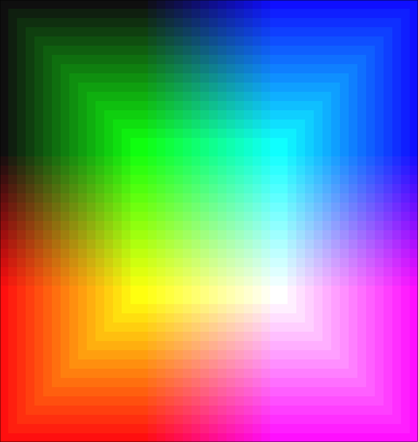

# Solid
The software unfold the rgb cube in a specific net and display it on terminal. 
Color amount, net shape, and cut orientation are configurable. Alternatively,
solid can show some HSL colors with hexcode. 

This project was made to learn more about colors and Rust.

## Installation
### Built binaries
Get it at [releases page](https://github.com/hecto600/Solid/releases)
### Build from source
```bash
git clone https://github.com/hecto600/Solid.git
cd solid 
cargo build --release 

```
## Usage
`solid [command][flag][options]...`

### Commands
#### rgb
Shows a 2d mapping rgb cube, with differents nets.\
**Example**: `solid rgb`
>  - Options:
>>    -b \<number\>:
      Bits quantitiy of each r,g,b channel. The range interval is [1,8].\
      **Example**: `solid -b 3`.  

>>    -n \<name\>:  
      Type of 2d representation of the rgb cube. Available nets <name> are 
      "ladder" and "cross".\
      **Example**: `solid -n cross`  

>>    -c \<name\>: 
      Variation of where the cube is opened. It defines which planes are separeted or not.
      Available \<name\> are `a` and `b`.\
      **Example**: `solid -c a`

>  - Flag:
>>    -f: Activate fill effect. Repeat the color to fullfill a rectangle

#### hsl
Shows colors with Hue, saturation and lightness parameters.\
**Example**: `solid hsl`
